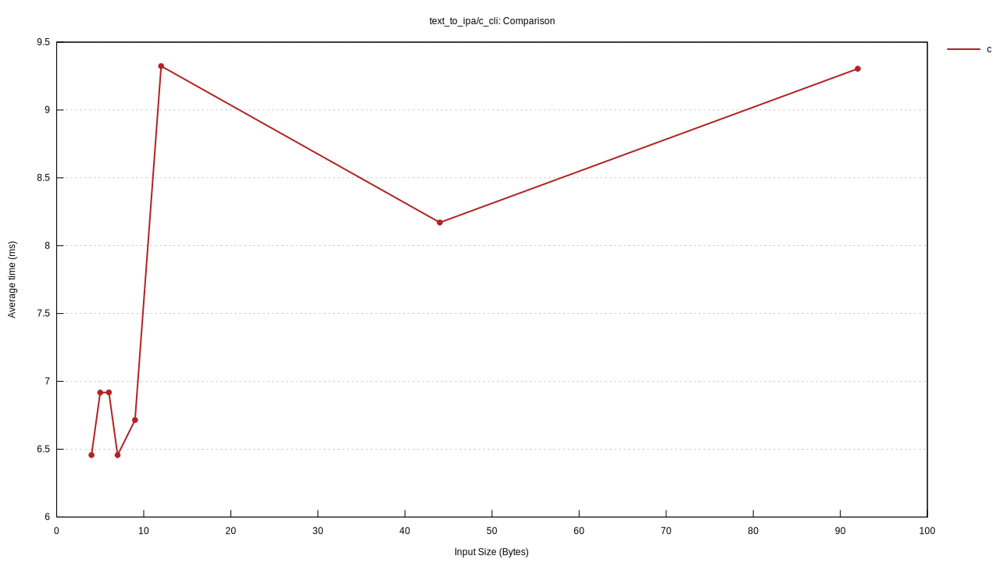
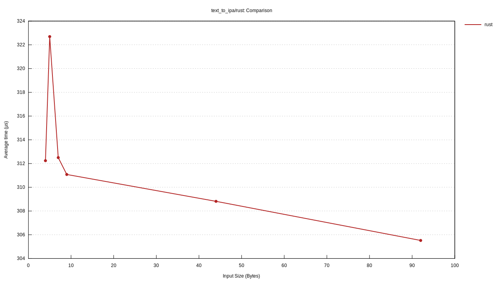

# Benchmark Results

Generated: 2026-03-12 05:51 UTC  
Platform: `Darwin 25.3.0 arm64`  
Rust: `rustc 1.93.1 (01f6ddf75 2026-02-11)`  
eSpeak NG: `not installed`

> **Reading this file**  
> Times are wall-clock per operation (lower is better).  
> Throughput is input bytes or elements processed per second (higher is better).  
> **Rust** rows show the pure-Rust implementation; rows marked **c\_cli** call
> the `espeak-ng` binary as a subprocess (includes process-spawn overhead).  
> During the stub phase, Rust `text_to_ipa` rows measure error-path overhead
> only and will be replaced by real numbers as each module is implemented.

---

## encoding/name_lookup

| Function | Input           | Mean      | ±Std      |
| -------- | --------------- | --------- | --------- |
| rust     |                 | 3.124 ns  | ±0.135 ns |
| rust     | ISO-10646-UCS-2 | 23.608 ns | ±1.677 ns |
| rust     | ISO-8859-1      | 17.812 ns | ±3.125 ns |
| rust     | ISO-8859-15     | 27.805 ns | ±2.998 ns |
| rust     | KOI8-R          | 26.851 ns | ±5.626 ns |
| rust     | US-ASCII        | 16.723 ns | ±0.429 ns |
| rust     | UTF-8           | 20.143 ns | ±1.564 ns |
| rust     | bogus           | 20.062 ns | ±0.793 ns |


## encoding/utf8_decode

| Function           | Input         | Mean       | ±Std        | Throughput  |
| ------------------ | ------------- | ---------- | ----------- | ----------- |
| collect_codepoints | ascii_long    | 441.449 ns | ±20.386 ns  | 192.55 MB/s |
| collect_codepoints | ascii_short   | 103.326 ns | ±5.545 ns   | 106.46 MB/s |
| collect_codepoints | cyrillic      | 311.202 ns | ±7.034 ns   | 295.63 MB/s |
| collect_codepoints | emoji         | 155.045 ns | ±3.533 ns   | 187.04 MB/s |
| collect_codepoints | japanese      | 165.971 ns | ±3.651 ns   | 343.43 MB/s |
| collect_codepoints | latin_accents | 250.752 ns | ±5.882 ns   | 175.47 MB/s |
| collect_codepoints | long_utf8     | 11.835 µs  | ±321.727 ns | 304.18 MB/s |
| collect_codepoints | mixed         | 193.647 ns | ±10.380 ns  | 206.56 MB/s |
| decode_to_string   | ascii_long    | 319.153 ns | ±10.252 ns  | 266.33 MB/s |
| decode_to_string   | ascii_short   | 76.858 ns  | ±5.761 ns   | 143.12 MB/s |
| decode_to_string   | cyrillic      | 334.990 ns | ±9.596 ns   | 274.63 MB/s |
| decode_to_string   | emoji         | 133.492 ns | ±6.468 ns   | 217.24 MB/s |
| decode_to_string   | japanese      | 218.140 ns | ±4.539 ns   | 261.30 MB/s |
| decode_to_string   | latin_accents | 209.386 ns | ±4.976 ns   | 210.14 MB/s |
| decode_to_string   | long_utf8     | 10.460 µs  | ±1.420 µs   | 344.18 MB/s |
| decode_to_string   | mixed         | 159.209 ns | ±6.547 ns   | 251.24 MB/s |
| rust               | ascii_long    | 308.117 ns | ±4.440 ns   | 275.87 MB/s |
| rust               | ascii_short   | 69.380 ns  | ±3.395 ns   | 158.55 MB/s |
| rust               | cyrillic      | 333.824 ns | ±9.683 ns   | 275.59 MB/s |
| rust               | emoji         | 126.940 ns | ±3.792 ns   | 228.46 MB/s |
| rust               | japanese      | 215.162 ns | ±4.580 ns   | 264.92 MB/s |
| rust               | latin_accents | 202.892 ns | ±4.824 ns   | 216.86 MB/s |
| rust               | long_utf8     | 11.999 µs  | ±1.101 µs   | 300.02 MB/s |
| rust               | mixed         | 168.322 ns | ±8.471 ns   | 237.64 MB/s |
| rust_iter          | ascii_long    | 431.171 ns | ±7.369 ns   | 197.14 MB/s |
| rust_iter          | ascii_short   | 102.034 ns | ±1.641 ns   | 107.81 MB/s |
| rust_iter          | cyrillic      | 320.650 ns | ±5.459 ns   | 286.92 MB/s |
| rust_iter          | emoji         | 183.411 ns | ±46.306 ns  | 158.11 MB/s |
| rust_iter          | japanese      | 209.330 ns | ±54.539 ns  | 272.30 MB/s |
| rust_iter          | latin_accents | 248.284 ns | ±4.837 ns   | 177.22 MB/s |
| rust_iter          | long_utf8     | 12.373 µs  | ±545.641 ns | 290.95 MB/s |
| rust_iter          | mixed         | 200.809 ns | ±19.578 ns  | 199.19 MB/s |


## latency/first_phoneme

| Function | Input          | Mean       | ±Std        |
| -------- | -------------- | ---------- | ----------- |
| c_cli    | de/guten       | 5.194 ms   | ±92.448 µs  |
| c_cli    | en/hello       | 5.893 ms   | ±526.242 µs |
| c_cli    | en/hello_world | 5.996 ms   | ±459.116 µs |
| c_cli    | en/hi          | 5.647 ms   | ±504.952 µs |
| c_cli    | fr/bonjour     | 5.123 ms   | ±112.031 µs |
| rust     | de/guten       | 621.034 ns | ±4.849 ns   |
| rust     | en/hello       | 652.699 ns | ±14.505 ns  |
| rust     | en/hello_world | 658.922 ns | ±6.929 ns   |
| rust     | en/hi          | 642.768 ns | ±14.030 ns  |
| rust     | fr/bonjour     | 620.175 ns | ±4.040 ns   |


## synthesize/resonator

| Function                | Mean       | ±Std        | Throughput       |
| ----------------------- | ---------- | ----------- | ---------------- |
| tick_64_samples         | 173.228 ns | ±3.052 ns   | -                |
| tick_one_second_22050hz | 60.343 µs  | ±791.191 ns | 365410037 elem/s |
| tick_single             | 3.470 ns   | ±0.305 ns   | -                |


## text_to_ipa/c_cli

| Function | Input        | Mean     | ±Std        | Throughput |
| -------- | ------------ | -------- | ----------- | ---------- |
| c        | de/word      | 5.371 ms | ±289.406 µs | 1.68 KB/s  |
| c        | en/paragraph | 8.230 ms | ±874.987 µs | 11.18 KB/s |
| c        | en/sentence  | 6.606 ms | ±441.505 µs | 6.66 KB/s  |
| c        | en/word      | 5.520 ms | ±199.838 µs | 0.91 KB/s  |
| c        | es/word      | 5.491 ms | ±292.922 µs | 0.73 KB/s  |
| c        | fr/word      | 5.418 ms | ±221.564 µs | 1.29 KB/s  |
| c        | ru/word      | 8.203 ms | ±868.216 µs | 1.46 KB/s  |
| c        | zh/word      | 6.174 ms | ±340.313 µs | 0.97 KB/s  |




## text_to_ipa/rust

| Function | Input        | Mean       | ±Std       | Throughput  |
| -------- | ------------ | ---------- | ---------- | ----------- |
| rust     | de/word      | 311.079 µs | ±8.395 µs  | 28.93 KB/s  |
| rust     | en/paragraph | 305.522 µs | ±28.565 µs | 301.12 KB/s |
| rust     | en/sentence  | 308.817 µs | ±66.466 µs | 142.48 KB/s |
| rust     | en/word      | 322.693 µs | ±95.233 µs | 15.49 KB/s  |
| rust     | es/word      | 312.240 µs | ±5.221 µs  | 12.81 KB/s  |
| rust     | fr/word      | 312.501 µs | ±18.558 µs | 22.40 KB/s  |




---

## Notes

- Times are [criterion](https://github.com/bheisler/criterion.rs) means over
  100 samples (15 for CLI subprocess groups).
- **c\_cli** benchmarks include subprocess spawn + espeak-ng initialisation +
  data file loading on every call — this is the real-world latency a caller
  would see when shelling out to `espeak-ng`.
- The **bundled-espeak** feature (`cargo bench --features bundled-espeak`)
  downloads and compiles espeak-ng from source so the C baseline runs even
  without a system installation.
- Once the Rust `translate` module is implemented, the **rust** rows in the
  `text_to_ipa` groups will reflect actual pipeline performance.
- Charts are Criterion's SVG output copied into `benches/results/` so they
  render directly in GitHub without needing `target/` to be checked in.

## Re-running

```bash
# Using system espeak-ng (must be on PATH)
./benches/bench.sh

# Building espeak-ng from source automatically
./benches/bench.sh --bundled

# Only encoding benchmarks
./benches/bench.sh --filter encoding

# Parse existing results without re-running
./benches/bench.sh --no-run
```
