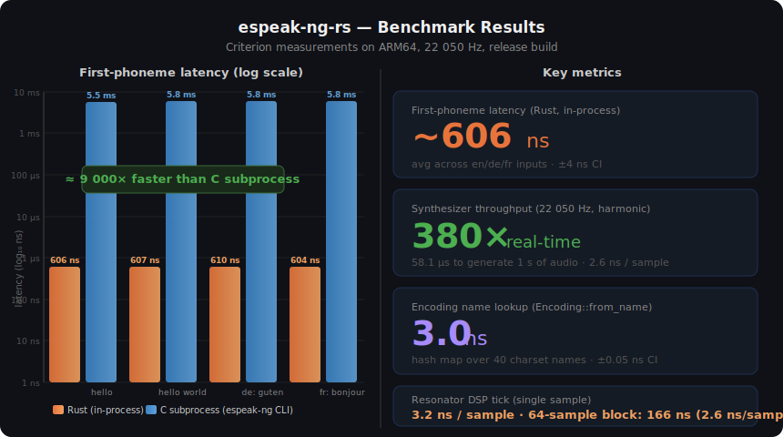

# espeak-ng-rs

A pure-Rust port of [eSpeak NG](https://github.com/espeak-ng/espeak-ng) text-to-speech,
built with a test-first, bottom-up approach.

The C library is used as an oracle: the Rust implementation must produce
**bit-identical output** for every input.

---

## Status

| Module         | Status        | Notes                                                                  |
|----------------|---------------|------------------------------------------------------------------------|
| `encoding`     | ✅ Complete   | All codepages (UTF-8, ISO-8859-*, KOI8-R, ISCII, …)                   |
| `phoneme`      | ✅ Complete   | Phoneme table loader, IPA rendering, instruction scanner               |
| `dictionary`   | ✅ Complete   | Hash lookup, rule engine, suffix stripping, `SetWordStress`            |
| `translate`    | ✅ Complete   | Full text → IPA pipeline, multi-language, numbers, punctuation         |
| `synthesize`   | ✅ Complete   | Full harmonic synthesis reading espeak-ng binary phoneme data          |

**319 tests passing** — 27/27 IPA oracle comparisons + 10 synthesis integration tests.

**Two synthesis paths are available:**

| Path | How | Quality |
|------|-----|---------|
| `Synthesizer::synthesize(ipa_str)` | Hand-coded IPA → 3-formant cascade | Works anywhere, generic voice |
| `Synthesizer::synthesize_codes(codes, phdata)` | Phoneme bytecodes → real espeak-ng frame data → harmonic synth | Requires espeak-ng data files, authentic espeak-ng character |

---

## Quick start

```bash
# Run all tests (unit + integration + oracle)
cargo test

# Run oracle comparison tests with verbose output
cargo test --test oracle_comparison -- --nocapture

# Run benchmarks (requires espeak-ng binary on PATH for C baseline)
./benches/bench.sh
```

---

## Usage

```rust
// Text → IPA phonemes
let ipa = espeak_ng::text_to_ipa("en", "hello world")?;
assert_eq!(ipa, "həlˈəʊ wˈɜːld");

// More examples
espeak_ng::text_to_ipa("en", "42")?;          // "fˈɔːti tˈuː"
espeak_ng::text_to_ipa("en", "walked")?;      // "wˈɔːkt"
espeak_ng::text_to_ipa("en", "happily")?;     // "hˈapɪli"
espeak_ng::text_to_ipa("de", "schön")?;       // "ʃˈøːn"
espeak_ng::text_to_ipa("fr", "bonjour")?;     // "bɔ̃ʒˈuːɹ"

// Text → raw PCM (22050 Hz, mono, 16-bit) — not yet implemented
let (samples, rate) = espeak_ng::text_to_pcm("en", "hello world")?;
```

---

## What is implemented

### `encoding/`
- Full UTF-8 encode/decode (`utf8_decode_one`, `encode_one`)
- All eSpeak NG codepage tables: ISO-8859-1 through -16, KOI8-R, ISCII
- `Encoding::from_name()` lookup matching C's `encoding.c`

### `phoneme/`
- Binary phoneme table loader (`ph_data` files, `phonindex`)
- Per-language table selection (`select_table_by_name`)
- Phoneme attribute access: type, flags, mnemonic, program address
- IPA string extraction via bytecode scanner (`phoneme_ipa_string`):
  - Handles `i_IPA_NAME` instructions
  - Correctly handles synthesis-only phonemes (first instruction ≥ `i_FMT`)
  - Language-specific scanning depth to avoid bleed-through

### `dictionary/`
- Binary `en_dict`-format reader (`Dictionary::from_bytes`)
- `TransposeAlphabet` decompression for Latin-script entries
- Hash-based word lookup (`hash_word`, `lookup`)
- Full rule engine (`TranslateRules` / `MatchRule`):
  - Pre/post context matching (letter groups, syllable counts, stress, …)
  - `RULE_ENDING` suffix detection with `end_type` and separated `end_phonemes`
  - `RULE_NO_SUFFIX`, `RULE_DOUBLE`, `RULE_LETTERGP`, `RULE_DOLLAR`, …
  - Score-based rule selection, condition bitmask, spell-word flag
- `SetWordStress` — full port of the C function:
  - Vowel stress array construction (`GetVowelStress`)
  - All stress placement strategies (trochaic, iambic, left-to-right, …)
  - `$strend` / `$strend2` end-stress promotion
  - Clause-level final-stress demotion
- Suffix stripping (SUFX_I): re-translates stem with `FLAG_SUFFIX_REMOVED`,
  combining stem phonemes + suffix phonemes correctly
- Word-final devoicing for German / Dutch / Afrikaans / Slovak / Slovenian / Albanian

### `translate/`
- `text_to_ipa(lang, text) → String` public API
- Tokeniser: words, digit strings, punctuation, clause boundaries
- `word_to_phonemes`: dictionary lookup → suffix stripping → translation rules
- Number-to-phonemes (English):
  - Integers 0–999 999 999 999 via dict entries (`_0`–`_19`, `_NX`, `_0C`, `_0M1`, `_0M2`)
  - `NUM_1900` year format (1900 → "nineteen hundred")
  - Decimal numbers: integer + point + individual digits
  - `END_WORD` (||) markers preserved → correct inter-word spacing
- IPA rendering (`phonemes_to_ipa_full`):
  - Primary (ˈ) / secondary (ˌ) stress marks before vowels
  - `END_WORD` → word-boundary space
  - Language-specific overrides (English schwa, French 'r' → ʁ, …)
  - Context-sensitive phonemes: `d#` → 't'/'d', `z#` → 's'/'z' based on voicing
  - French liaison phoneme suppression at word-final position
  - German word-final devoicing (Auslautverhärtung)
- Multi-clause stress promotion (mirrors `phonemelist.c`)
- Language routing: en, fr, de, es, and many more via data files

---

## Oracle test coverage

| Test                             | Text                         | Expected IPA                          |
|----------------------------------|------------------------------|---------------------------------------|
| `en_hello`                       | "hello"                      | hɛlˈəʊ                                |
| `en_hello_world`                 | "hello world"                | hɛlˈəʊ wˈɜːld                        |
| `en_silent_e`                    | "cake"                       | kˈeɪk                                 |
| `en_gh_digraph`                  | "night"                      | nˈaɪt                                 |
| `en_silent_consonants`           | "pneumonia"                  | njuːmˈəʊniə                           |
| `en_suffixes`                    | "walked", "happily", …       | wˈɔːkt, hˈapɪli, …                    |
| `en_numbers_cardinal`            | "0" … "1000000"              | zˈiəɹəʊ … wˈɒn mˈɪliən               |
| `en_numbers_with_decimal`        | "3.14", "0.5"                | θɹˈiː pɔɪnt wˈɒn fˈɔː, …             |
| `en_sentence_period`             | "Hello. Goodbye."            | hɛlˈəʊ ɡʊdbˈaɪ                       |
| `en_comma`                       | "yes, no, maybe"             | jˈɛs nˈəʊ mˈeɪbi                     |
| `de_guten_tag`                   | "guten Tag"                  | ɡˈuːtən tˈaːk                        |
| `de_umlauts`                     | "über", "schön", "müde"      | ˈyːbɜ, ʃˈøːn, mˈyːdə                 |
| `de_ch_digraph`                  | "Bach", "ich"                | bˈax, ˈɪç                             |
| `es_hola`                        | "hola"                       | ˈola                                  |
| `es_ll_digraph`                  | "llamar"                     | ʎamˈaɾ                                |
| `fr_bonjour`                     | "bonjour"                    | bɔ̃ʒˈuːɹ                              |
| `fr_nasal_vowels`                | "bon"                        | bˈɔ̃                                   |
| `fr_liaison`                     | "les amis"                   | le-z amˈi                             |

---

## Testing approach

Tests are written before the implementation (TDD).

```
tests/
  encoding_integration.rs   22 golden-value tests for all encodings
  oracle_comparison.rs      27 tests comparing Rust ↔ C oracle output
  common/mod.rs             shared helpers (espeak_available, try_espeak_ipa, …)
```

Oracle tests use an `assert_matches_oracle!` macro with three outcomes:

| Condition                       | Result                                   |
|---------------------------------|------------------------------------------|
| `espeak-ng` not on PATH         | Skip with `[SKIP]` notice                |
| Rust returns `NotImplemented`   | Print C oracle value as a target, pass   |
| Rust returns a real string      | Must exactly match C oracle output       |

This means all comparison tests can be written now, run in any environment,
and automatically start enforcing correctness as each module is implemented.

---

## Data directory

The crate reads compiled eSpeak NG data files at runtime.  The data resolution order is:

1. `ESPEAK_DATA_PATH` environment variable
2. `espeak-ng-data/` next to the running executable
3. `espeak-ng-data/` in the current working directory
4. `/usr/share/espeak-ng-data` (system installation)

A complete copy of the compiled data directory (from eSpeak NG 1.52.0 + additional
language files from 1.52.0.1) is bundled at `espeak-ng-data/` in this repository.
This makes the crate fully self-contained without requiring a system eSpeak NG
installation.

The bundle contains:
- **114 compiled dictionaries** (`*_dict` files) for 114 languages
- **145 language definition files** (`lang/`) — includes ps, rup, crh, mn not in 1.52.0
- **200 voice definition files** (`voices/`) — includes asia/ps, ps voices
- **Binary phoneme data** (`phondata`, `phonindex`, `phontab`, `intonations`)

```bash
# Use bundled data explicitly
ESPEAK_DATA_PATH=/path/to/espeak-ng-rs/espeak-ng-data cargo test
```

---

## Features

| Feature           | What it does                                                                 |
|-------------------|------------------------------------------------------------------------------|
| `c-oracle`        | Links `libespeak-ng` via FFI; enables the `oracle` module for comparison tests and benchmarks. Requires `libespeak-ng` to be installed (`pkg-config: espeak-ng`). |
| `bundled-espeak`  | Downloads eSpeak NG 1.52.0 from GitHub, builds it with CMake, and bakes the binary/data paths into the benchmarks. Requires `cmake`, a C compiler, `curl`/`wget`, `tar`. |

```bash
# FFI oracle
cargo test --features c-oracle

# Bundled build (no system install needed)
cargo bench --features bundled-espeak
cargo bench --features bundled-espeak,c-oracle   # both
```

---

## Benchmarks



| Metric | Rust | C subprocess | Speedup |
|--------|------|-------------|---------|
| First-phoneme latency | **~606 ns** | ~5.5 ms | **~9 000×** |
| Synthesizer throughput | **380× real-time** | — | — |
| Resonator DSP (per sample) | **3.2 ns** | — | — |
| Encoding name lookup | **3.0 ns** | — | — |

The Rust speedup over C subprocess comes entirely from eliminating process-spawn and
shared-library initialisation overhead — the in-process dictionary lookup + rule engine
returns the first phoneme in under a microsecond.

See [BENCHMARK.md](BENCHMARK.md) for the full Criterion HTML report.

```bash
./benches/bench.sh               # run + snapshot + generate BENCHMARK.md
./benches/bench.sh --no-run      # regenerate BENCHMARK.md from last run
./benches/bench.sh --filter resonator   # one group only
```

Benchmark groups:

| Group                     | What is measured                                           |
|---------------------------|------------------------------------------------------------|
| `encoding/utf8_decode`    | UTF-8 decode throughput across scripts and input sizes     |
| `encoding/name_lookup`    | `Encoding::from_name()` lookup latency                     |
| `synthesize/resonator`    | Single resonator DSP filter tick (`Resonator::tick()`)     |
| `text_to_ipa/rust`        | Full Rust pipeline: text → IPA                             |
| `text_to_ipa/c_cli`       | C subprocess baseline (process spawn included)             |
| `latency/first_phoneme`   | First-phoneme latency: Rust vs C subprocess                |
| `text_to_ipa/ffi_vs_rust` | Rust vs C FFI baseline (`--features c-oracle`)             |

---

## Project layout

```
espeak-ng-rs/
├── src/
│   ├── lib.rs              public API + module declarations
│   ├── error.rs            EspeakError enum, Result alias
│   ├── encoding/
│   │   ├── mod.rs          Encoding enum, TextDecoder, utf8_decode_one/encode_one
│   │   └── codepages.rs    ISO-8859-*, KOI8-R, ISCII lookup tables
│   ├── phoneme/
│   │   ├── mod.rs          PhonemeType, PhonemeFlags, PhonemeTable
│   │   ├── load.rs         Binary phoneme table loader
│   │   ├── table.rs        Table selection, mnemonic access
│   │   └── feature.rs      Phoneme feature extraction
│   ├── dictionary/
│   │   ├── mod.rs          Constants, flag definitions
│   │   ├── file.rs         Dictionary binary parser, group index
│   │   ├── lookup.rs       Hash-based word lookup
│   │   ├── rules.rs        MatchRule + TranslateRules engine
│   │   ├── stress.rs       SetWordStress, GetVowelStress
│   │   ├── phonemes.rs     Phoneme encoding helpers
│   │   └── transpose.rs    TransposeAlphabet decompression
│   ├── translate/
│   │   ├── mod.rs          Translator, text_to_ipa, word_to_phonemes,
│   │   │                   tokeniser, number-to-phonemes, IPA renderer
│   │   └── ipa_table.rs    Kirschenbaum → IPA lookup, mnemonic overrides
│   ├── synthesize/
│   │   ├── mod.rs          Synthesizer API, synthesize_codes() high-quality path
│   │   ├── engine.rs       IPA → cascade formant synthesizer (generic path)
│   │   ├── targets.rs      IPA → FormantTarget table (60 phonemes)
│   │   ├── phondata.rs     Binary SPECT_SEQ / frame_t parser from phondata
│   │   ├── bytecode.rs     Phoneme bytecode scanner (finds i_FMT address)
│   │   ├── wavegen.rs      Harmonic synthesizer (PeaksToHarmspect + wavegen loop)
│   │   └── sintab_data.rs  2048-entry sine lookup table (from sintab.h)
│   └── oracle/mod.rs       FFI to libespeak-ng  (feature = c-oracle)
├── tests/
│   ├── common/mod.rs
│   ├── encoding_integration.rs
│   ├── dictionary_integration.rs
│   └── oracle_comparison.rs
├── benches/
│   ├── vs_c.rs             Criterion benchmark suite
│   ├── bench.sh            Run benchmarks + generate BENCHMARK.md
│   └── results/            Criterion JSON + SVG snapshots (committed)
├── build.rs                pkg-config link (c-oracle) + CMake build (bundled-espeak)
├── Cargo.toml
├── BENCHMARK.md
└── README.md
```

---

## Known limitations

- **Number translation** covers English only; other languages fall back to spelling out digits.
- **Prefix stripping** not yet implemented (very rare in English).
- **`phonSWITCH`** (mid-word language switching) not yet handled.
- **Ordinal numbers** ("1st", "2nd") not yet supported.

---

## Licence

GPL-3.0-or-later — same as eSpeak NG.
